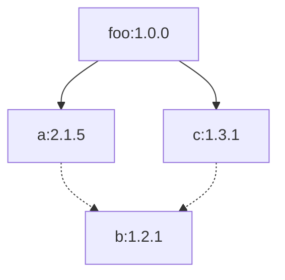
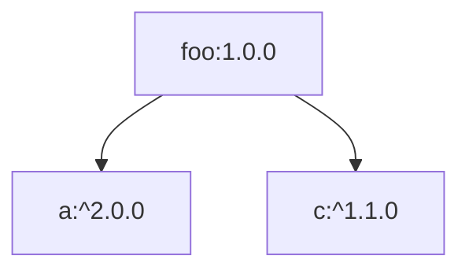
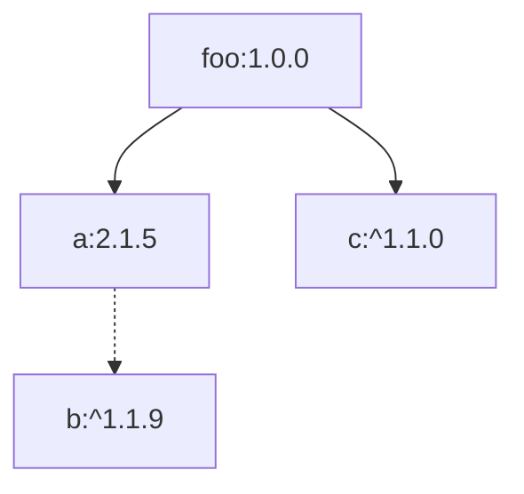

# OpenSCA技术原理之npm依赖解析

本文主要介绍基于npm包管理器的组件成分解析原理。

## npm 介绍

`npm`(全称`Node Package Manager`)是`Node.js`的预设软件包管理器。

`npm`的依赖管理文件是`package.json`。开发者可以在`package.json`中指定每个依赖项的版本范围。如果一个项目中存在`package.json`文件，便可以执行`npm install`命令自动安装和维护当前项目所需的所有模块并生成`package-lock.json`文件。

`package.json`完整文件结构如下：

```json
{
  "name": "screeps",
  "version": "1.0.0",
  "description": "",
  "main": "index.js",
  "scripts": {
    "push": "rollup -cw --environment DEST:main",
    "build": "rollup -cw --environment DEST:local",
  },
  "keywords": [],
  "author": "",
  "license": "ISC",
  "devDependencies": {
    "@rollup/plugin-commonjs": "^21.0.1",
    "@rollup/plugin-node-resolve": "^13.1.1",
    "@types/lodash": "^3.10.1",
    "@types/screeps": "^3.2.4",
    "rollup": "^2.61.1",
    "rollup-plugin-clear": "^2.0.7",
    "rollup-plugin-copy": "^3.4.0",
    "rollup-plugin-screeps": "^1.0.1",
    "rollup-plugin-typescript2": "^0.31.1",
    "typescript": "^4.5.4"
  },
  "dependencies": {
    "source-map": "^0.6.1"
  }
}
```

其中`name`为项目名，`version`为项目版本，`license`为项目声明的许可证。
`devDependencies`为开发环境使用的依赖，`dependencies`为生产环境使用的依赖。
依赖写法为`"name":"version"`，版本可以指定准确版本或一个范围，范围需遵循[`semver`语义化版本规范](https://semver.org/)。

## 解析算法

### package-lock.json

`package-lock.json`文件为自动生成的文件，可以准确定位到`npm`项目使用的依赖及版本，所以优先解析`package-lock.json`文件。

`package-lock.json`文件结构如下：

```json
{
  "name": "foo",
  "version": "1.0.0",
  "dependencies": {
    "b": {
      "version": "1.2.1"
    },
    "a": {
      "version": "2.1.5",
      "requires": {
        "b": "^1.1.9"
      }
    },
    "c": {
      "version": "1.3.1",
      "requires": {
        "b": "^1.2.0"
      }
    }
  }
}
```

其中`name`字段为项目名称，`version`字段为项目版本。

`dependencies`字段中包含项目使用的所有直接和间接依赖，而且记录了组件间的依赖关系。
例如：

```json
"b": {
  "version": "1.2.1"
},
```

代表组件`b`的版本号为`1.2.1`。

```json
"a": {
  "version": "2.1.5",
  "requires": {
    "b": "^1.1.9"
  }
},
```

代表项目依赖`2.1.5`版本的组件`a`，且该组件依赖版本约束为`^1.1.9`的组件`b`。
同理可知项目依赖`1.3.1`版本的组件`c`，且该组件依赖版本约束为`^1.2.0`的组件`b`。
且组件`a`和组件`c`都没有被其他依赖所依赖，所以可知这两个组件是项目的**直接依赖**。
**仅通过`package-lock.json`无法确定组件`b`是否是直接依赖，可以结合`package.json`文件进一步确定，没有`package.json`时，将`b`当作间接依赖处理。**
**若一个组件同时为直接和间接依赖，按直接依赖处理。**

> `^1.1.9`代表版本号需要`>=1.1.9`且`<2.0.0`  
> `^1.2.0`代表版本号需要`>=1.2.0`且`<2.0.0`  
> 更多约束格式请参阅[`semver`官网](https://semver.org/)

由此可以构建出当前项目的依赖结构：



> 实线代表直接依赖，虚线代表间接依赖

### package.json

`package.json`为开发者编写管理的依赖管理文件，在未找到`package-lock.json`文件时将解析该文件。
`package.json`仅包含直接依赖，在项目构建时会从`npm`仓库下载需要的间接依赖并构建为`package-lock.json`文件，因此可以模拟`npm`构建流程来获取项目引用的组件依赖。

`package.json`文件结构如下：

```json
{
  "name": "foo",
  "version": "1.0.0",
  "devDependencies": {
    "a": "^2.0.0"
  },
  "dependencies": {
    "c": "^1.1.0"
  }
}
```

`dependencies`为项目实际使用的直接依赖，`devDependencies`为项目开发时使用的直接依赖。

例如：

```json
"devDependencies": {
  "a": "^2.0.0"
}
```

代表项目开发过程中依赖版本约束为`^2.0.0`的组件`a`。

```json
"dependencies": {
  "c": "^1.1.0"
}
```

代表项目直接依赖版本约束为`^1.1.0`组件`c`。

分析到这里我们可以总结出如下图依赖关系：



通过该依赖关系可以看出项目组件的直接依赖及组件的版本范围，但无法得知组件依赖的具体版本。

在没有`package-lock.json`文件的情况下，为了进一步获取依赖的准确版本及间接依赖，需要从[`npm`仓库](https://r.cnpmjs.org/)下载对应组件的详细信息。

例如组件`a`的详细信息结构为：

```json
{
  "time": {
    "2.1.5": "2011-02-16T22:31:02.088Z",
    "3.1.1": "2011-04-10T12:23:22.088Z"
  },
  "versions": {
    "2.1.5": {
      "dependencies": {
        "b": "^1.1.9"
      }
    },
    "3.1.1": {
      "dependencies": {
        "b": "^2.2.0"
      }
    }
  }
}
```

其中`time`字段为组件所有版本及发布日期，根据约束从这里获取约束范围内的最大版本。
`versions`字段为组件各个版本对应的详细信息，其中`dependencies`字段为组件的依赖信息。

对于本例来说，组件`a`的约束为`^2.0.0`，要求版本号`>=2.0.0`且`<3.0.0`，所以选择`2.1.5`版本。

因此组件依赖结构就变成了：



按照这种方式层级解析便可获取整个项目的依赖信息。

